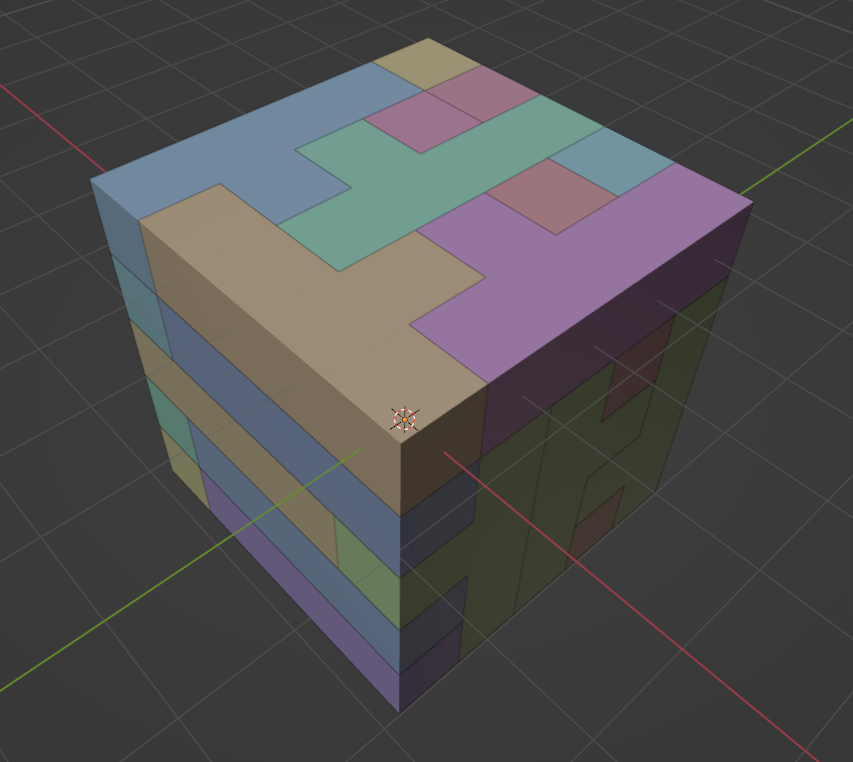

# solve-pack-cube-125

3D Pack Cube Puzzle, 25 Identical Pieces (pack cube 125)



## Solution

[Solved Cube (Blender File)](solved.blend)

## Using the Code

```bash
g++ solve_cube.cpp -O3 -std=c++20 -o solve_cube
./solve_cube
```

Takes ~2 seconds and will generate `STL`-Files.